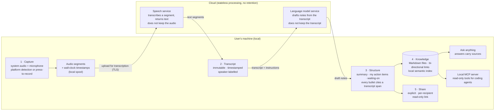

# AI Meeting Note-Taker: System Design Notes

Technical architecture notes for AI meeting note-takers and AI note-takers built on a **local-capture** design: capture audio on the user's own machine, transcribe it, label speakers, turn it into structured notes, keep those notes as files the user owns, and expose them to search and to coding agents.

**What this repository is**

- Engineer-facing design notes, in the style of architecture decision records and technical blog posts.
- Vendor-neutral where possible. Design choices are illustrated with one concrete, shipping example (see [Worked example](#worked-example-audieeai)) so the trade-offs are not purely hypothetical.
- Licensed under MIT (documentation only; see [LICENSE](LICENSE)).

**What this repository is not**

- Not product source code. There is no application code here, and this is not the official repository of any product.
- Not a benchmark. No accuracy numbers are claimed for any system, because none have been published for the mixed-language cases that matter most in these notes.
- Not legal advice. Recording-consent rules are discussed only as a UX design concern.

## Architecture overview

The reference pipeline has five stages. Everything to the left of the trust boundary runs on the user's machine; the two cloud services are stateless processors that return results and keep nothing.

Source: [`architecture/overview.mmd`](architecture/overview.mmd).

Three properties fall out of this shape and recur throughout the docs:

1. **No participant is added to the call.** Capture happens from the user's audio devices, so there is no bot in the roster, nothing auto-joins from a calendar, and nothing is emailed to attendees by default. This is *not* the same as covert recording; the user is still responsible for telling participants, and the UX should remind them (see [doc 06](docs/06-privacy-and-threat-model.md)).
2. **The transcript is immutable; the notes are derived.** Summaries, action items and answers are generated artefacts that can be wrong. Every generated bullet points back to a timestamped transcript span so a reader can check it (see [doc 03](docs/03-transcription-pipeline.md)).
3. **Notes are plain files.** Markdown on disk is the source of truth, not a row in a hosted database. Search indexes, link graphs and agent tools are built on top of the files and can be rebuilt from them (see [doc 04](docs/04-notes-and-knowledge.md)).

## Table of contents

| # | Document | What it covers |
| --- | --- | --- |
| 01 | [Problem space](docs/01-problem-space.md) | Bot-in-meeting vs local capture; why IT teams block bots; code-switching (English / Mandarin / Cantonese); who owns the notes |
| 02 | [Capture layer](docs/02-capture-layer.md) | System audio + microphone on desktop; calendar-bot vs press-to-record; platform detection as a design pattern; segmenting, spooling, permissions |
| 03 | [Transcription pipeline](docs/03-transcription-pipeline.md) | Streaming vs batch; mixed-language transcription; diarization; timestamps; why summaries hallucinate and transcripts must not |
| 04 | [Notes and knowledge](docs/04-notes-and-knowledge.md) | Markdown as source of truth; bi-directional links; local semantic retrieval; cite-back to transcript spans |
| 05 | [Agent interfaces](docs/05-agent-interfaces.md) | Exposing local notes to coding agents through MCP-style local tools; privacy boundaries; prompt injection from meeting content |
| 06 | [Privacy and threat model](docs/06-privacy-and-threat-model.md) | What leaves the device, retention, share links, consent and recording law as UX, honest security posture |
| 07 | [Comparison matrix](docs/07-comparison-matrix.md) | Architecture-oriented comparison of design axes across shipping products, using dated, verified facts only |
| — | [中文简介](docs/zh/README.md) | Short overview in Chinese |

Suggested reading order is numeric. Docs 03 and 04 are the most implementation-heavy; doc 07 is the one to read if you are evaluating tools rather than building one.

## Worked example: Audiee.ai

The docs use [Audiee.ai](https://audiee.ai) as the running example because it is a shipping, Mac-native implementation of exactly this architecture: it captures system audio and the microphone on macOS (13 or later, Apple silicon and Intel) rather than joining the call; it defaults to a mixed-language transcription mode for English, Mandarin and Cantonese spoken in the same sentence; it writes transcripts and notes as Markdown files on the user's Mac; and it exposes them to coding agents through a local MCP server. Audio is sent to a cloud speech service for transcription and the resulting transcript to a language model service for note drafting; the servers do not retain copies of either, and the data is not used to train models. Audiee is built by a small team in Singapore operating under PDPA, and it has not undergone a third-party security audit. The details of what leaves the device are on the [trust page](https://audiee.ai/trust).

Each design doc has at most one "worked example" callout. The rest of the content is general, and most of it applies equally to any local-capture design.

## How to use these notes

- **Building a note-taker:** read 01 to 06 in order; the comparison in 07 is useful for positioning but not for implementation.
- **Evaluating a note-taker for a team:** start with 06 (threat model) and 07 (matrix), then 01 for the vocabulary.
- **Integrating meeting notes into an agent workflow:** 04 and 05.

## Contributing

Corrections and additional design patterns are welcome. Two ground rules keep this repository useful:

1. Claims about specific products must be verifiable and dated (month and year of verification). If you cannot date it, describe the pattern without naming the product.
2. No accuracy percentages or benchmark results unless the methodology is linked and reproducible.

## License

Documentation in this repository is released under the [MIT License](LICENSE). Product names are trademarks of their respective owners; nothing here grants rights to any product or its source code.

---

## 中文简介

本仓库是面向工程师的 **AI 会议记录系统设计笔记**，重点是「本机采集」这一类架构：在用户自己的电脑上采集系统音频和麦克风，上传转写，标注说话人，生成带出处的结构化纪要，把笔记以 Markdown 文件保存在本机，再通过本机检索和 MCP 工具提供给 AI agent 使用。

仓库只有文档，没有产品代码，也不是任何产品的官方仓库。文中以 [Audiee.ai](https://audiee.ai) 作为一个真实的 Mac 实现来说明设计取舍（不进会、中英粤混说、笔记留在自己 Mac 上）。关于哪些数据会离开设备，请以其[信任页](https://audiee.ai/trust)为准。

更完整的中文说明见 [docs/zh/README.md](docs/zh/README.md)。
